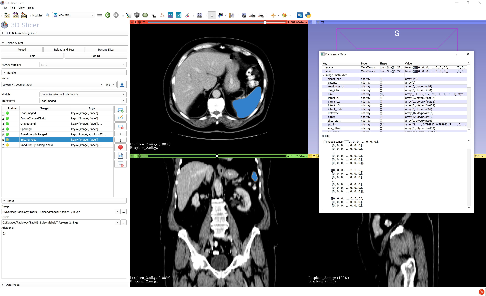

# MONAIViz

MONAIViz is an extension for 3D Slicer that helps to run chain of MONAI transforms and visualize every stage over an image/label.

## Modules

The extension provides a single module - **MONAIViz** - which currently supports:
- import pre-processing definitions for available bundles from MONAI model zoo
- add/remove/re-order any MONAI transform to the list of transforms
- apply a sequence of transforms step-by-step over input image/label
- visualize image/label outputs for every transform run
- check the data/dictionary stats for every transform run

## Installing Plugin

### Installing 3D Slicer

To use MONAIViz with 3D Slicer, you'll need to download and install 3D Slicer. MONAIViz supports the stable and preview versions of 3D Slicer, version 5.3 or higher. For more information on installing 3D Slicer, check out the [3D Slicer Documentation](https://slicer.readthedocs.io/en/latest/user_guide/getting_started.html#installing-3d-slicer)

### Installing MONAIViz Plugin

- Go to **View** -> **Extension Manager** -> **Developer Tools** -> **MONAIViz**
- Install MONAIViz plugin
- _**Restart**_ 3D Slicer

**Note:** To update the plugin to the latest version, you have to uninstall the existing 3D Slicer version and download and install the new preview version of 3D Slicer again

### Install Plugin in Developer Mode

- `git clone git@github.com:Project-MONAI/SlicerMONAIViz.git`
- Open 3D Slicer: Go to **Edit** -> **Application Settings** -> **Modules** -> **Additional Module Paths**
- Add New Module Path: _<FULL_PATH>_/SlicerMONAIViz/MONAIViz
- _**Restart**_ 3D Slicer

## Dependencies

MONAIViz depends on the following packages:

* [PyTorch Slicer extension](https://github.com/fepegar/SlicerPyTorch)
* `monai[itk,nibabel]` python packages

**Note:** After opening the MONAIViz module in 3D Slicer for the first time, you will be asked to confirm the installation of the packages.
